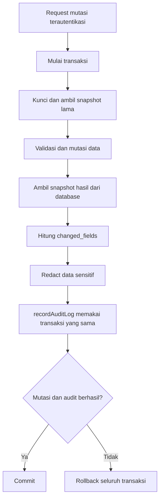

# Audit Trail dan Akses Aman Dokumen SK

Status: spesifikasi siap integrasi; backend belum tersedia di repository.

## 1. Hasil inspeksi repository

Inspeksi dilakukan pada 21 Juli 2026. Workspace tidak berisi file atau folder
proyek. Tidak ditemukan `package.json`, `composer.json`, `requirements.txt`,
`pyproject.toml`, `go.mod`, `Cargo.toml`, `docker-compose.yml`, contoh environment,
source backend/frontend, migration, ataupun konfigurasi test.

| Bagian | Hasil |
|---|---|
| Bahasa dan framework backend | Belum dapat diidentifikasi |
| ORM/database library | Belum dapat diidentifikasi |
| Database aktif | Belum dapat diidentifikasi; desain yang diminta menargetkan PostgreSQL |
| Autentikasi dan role | Belum tersedia |
| Testing framework | Belum tersedia |
| Modul prestasi | Belum tersedia |
| Modul dokumen SK/private storage | Belum tersedia |
| Model user, atlet, kepengurusan | Belum tersedia |

Karena fondasi backend tidak ada, dokumen ini tidak menetapkan framework, format
response final, nama role, atau package baru. SQL referensi tersedia di
[`sql/audit_logs.sql`](sql/audit_logs.sql), sedangkan contoh mutasi tersedia di
[`examples/prestasi-update-audit.json`](examples/prestasi-update-audit.json).

## 2. Tujuan dan batas kepercayaan

Audit trail merekam siapa melakukan tindakan apa, terhadap entitas mana, kapan,
dan snapshot data sebelum/sesudah perubahan. Log bersifat append-only dan tidak
boleh memiliki route aplikasi untuk update atau delete.

Perlindungan berlapis yang dirancang:

1. Mutasi data dan penulisan audit berada dalam satu transaksi database.
2. Aplikasi menulis melalui satu service generik, bukan repository CRUD umum.
3. Fungsi database melakukan redaction kedua sebelum insert.
4. Trigger menolak `UPDATE`, `DELETE`, dan `TRUNCATE`.
5. Runtime role hanya diberi `EXECUTE` pada fungsi insert dan `SELECT` bila perlu;
   runtime role tidak menjadi pemilik tabel dan tidak mendapat DML langsung.
6. API audit hanya menyediakan operasi baca dan dibatasi role berwenang.

Trigger bukan perlindungan terhadap superuser, pemilik tabel yang menonaktifkan
trigger, atau administrator yang mengubah schema. Akun migrasi/pemilik harus
dipisahkan dari akun runtime dan akses administratif harus diaudit oleh
infrastruktur database.

## 3. Alur audit



Untuk create, `old_values` bernilai null. Untuk delete, `new_values` bernilai
null. Untuk archive, keduanya berisi snapshot dan action adalah `ARCHIVE`.

## 4. Struktur `audit_logs`

| Kolom | Tipe referensi | Catatan |
|---|---|---|
| `id` | `bigint identity` | Primary key monotonik; bukan bukti kriptografis |
| `actor_id` | `text`, nullable | Tanpa FK sampai tipe/model user final; teks menerima ID bigint atau UUID |
| `action` | `text` | Dibatasi action yang didukung dengan check constraint |
| `entity_type` | `text` | Nama domain stabil, misalnya `prestasi` |
| `entity_id` | `text`, nullable | Teks agar kompatibel dengan beberapa strategi primary key |
| `old_values` | `jsonb`, nullable | Snapshot sebelum perubahan yang sudah di-redact |
| `new_values` | `jsonb`, nullable | Snapshot sesudah perubahan yang sudah di-redact |
| `changed_fields` | `jsonb`, nullable | Array nama field tingkat atas yang benar-benar berubah |
| `request_id` | `text`, nullable | Correlation ID dari middleware/request context |
| `ip_address` | `inet`, nullable | Alamat client yang telah dinormalisasi oleh trusted proxy config |
| `user_agent` | `text`, nullable | Batasi panjang di application layer untuk mencegah log abuse |
| `created_at` | `timestamptz` | Waktu server database |

Index tersedia untuk `(entity_type, entity_id)`, `actor_id`, `action`, dan
`created_at DESC`. Snapshot sebaiknya berupa representasi row hasil database,
bukan request mentah, agar default, cast, dan perubahan ORM ikut tercatat.

## 5. Kontrak service generik

Nama konkret mengikuti bahasa dan gaya backend yang nanti dipilih. Kontrak
semantiknya:

```text
recordAuditLog(transaction, input) -> AuditLogId

input:
  actorId: string | null
  action: CREATE | UPDATE | DELETE | ARCHIVE |
          LOGIN | UPLOAD_DOCUMENT | DOWNLOAD_DOCUMENT | REPLACE_DOCUMENT
  entityType: non-empty string
  entityId: string | null
  oldValues: JSON object | null
  newValues: JSON object | null
  changedFields: string[] | null
  requestContext:
    requestId: string | null
    ipAddress: string | null
    userAgent: string | null

guarantees:
  - menggunakan transaction/connection yang diberikan caller;
  - tidak membuka atau commit transaksi mandiri;
  - melakukan redaction rekursif sebelum penyimpanan;
  - melempar error jika insert audit gagal;
  - tidak pernah menerima password/token/header Authorization sebagai context;
  - tidak menyediakan update atau delete.
```

Adapter database memanggil `public.record_audit_log(...)` dari SQL referensi.
Service aplikasi tetap wajib melakukan redaction; fungsi SQL merupakan lapisan
cadangan, bukan pengganti validasi aplikasi.

### Integrasi CRUD prestasi

Pseudocode stack-netral untuk update:

```text
database.transaction(tx => {
  before = prestasiRepository.findByIdForUpdate(tx, prestasiId)
  assertFound(before)
  validated = validateUpdate(request.body)
  after = prestasiRepository.updateAndReturn(tx, prestasiId, validated)
  changedFields = topLevelChangedKeys(before, after)

  if changedFields is not empty:
    recordAuditLog(tx, {
      actorId: authenticatedUser.id,
      action: "UPDATE",
      entityType: "prestasi",
      entityId: string(prestasiId),
      oldValues: before,
      newValues: after,
      changedFields,
      requestContext
    })

  return after
})
```

Gunakan `SELECT ... FOR UPDATE` atau primitive locking ORM yang setara agar dua
update bersamaan tidak mencatat snapshot lama yang salah. Create harus mencatat
row hasil insert. Delete harus mengambil/mengembalikan row sebelum delete.
Archive adalah update status dengan action `ARCHIVE`. Bila audit insert gagal,
error tidak boleh ditangkap lalu diabaikan; transaksi utama harus rollback.

`topLevelChangedKeys` membandingkan nilai yang sudah dinormalisasi dari database.
Perubahan anak di dalam `metadata_dinamis` menghasilkan field
`metadata_dinamis`; detail lengkapnya tetap terlihat pada kedua snapshot JSONB.
Urutan key object JSON tidak dianggap perubahan, tetapi urutan elemen array
dianggap perubahan.

## 6. Redaction

Redaction wajib rekursif dan tidak peka huruf besar/kecil. Minimal key berikut,
termasuk variasi `snake_case`, `camelCase`, atau pemisah lain, diganti dengan
`"[REDACTED]"`:

- password dan passphrase;
- access/refresh token dan token lainnya;
- API key dan client secret;
- session cookie;
- authorization header;
- secret key.

Isi PDF tidak pernah masuk `old_values`/`new_values`; hanya metadata aman seperti
document ID, nama logis, ukuran, dan content type. Signed token mentah, cookie,
header request lengkap, dan body upload tidak boleh diteruskan ke audit service.
Daftar sensitif harus diperluas saat model domain tersedia.

## 7. Kontrak endpoint audit read-only

Endpoint konseptual (baru boleh diimplementasikan setelah router, response
standard, autentikasi, dan role proyek tersedia):

```http
GET /api/v1/audit-logs?page=1&page_size=25
GET /api/v1/audit-logs?entity_type=prestasi&entity_id=15
GET /api/v1/audit-logs?action=UPDATE&actor_id=7
GET /api/v1/audit-logs?created_from=2026-07-01T00:00:00Z&created_to=2026-08-01T00:00:00Z
```

Aturan kontrak:

- wajib autentikasi dan role/policy pembaca audit;
- urutan selalu `created_at DESC, id DESC` agar pagination deterministik;
- `page >= 1`, default `page_size = 25`, maksimum `page_size = 100`;
- action harus diambil dari allow-list dan tanggal harus ISO 8601 bertimezone;
- `entity_type`, `entity_id`, `actor_id`, dan rentang tanggal memakai parameter
  query terikat, bukan SQL string interpolation;
- response mengikuti envelope API proyek yang nanti ditemukan;
- tidak ada route `POST`, `PUT`, `PATCH`, atau `DELETE` untuk audit log.

Contoh payload isi response (envelope belum ditetapkan):

```json
{
  "items": [
    {
      "id": 1001,
      "actor_id": "7",
      "action": "UPDATE",
      "entity_type": "prestasi",
      "entity_id": "15",
      "changed_fields": ["medali", "metadata_dinamis"],
      "created_at": "2026-07-21T10:00:00+07:00"
    }
  ],
  "page": 1,
  "page_size": 25,
  "total": 1
}
```

## 8. Desain akses aman PDF SK

Bagian ini belum dapat diimplementasikan karena autentikasi, authorization,
model dokumen, private storage, route dokumen, dan secret management belum ada.
Titik integrasi yang harus disediakan backend:

```text
issueDocumentAccess(currentUser, documentId) -> { accessUrl, expiresAt }
streamAuthorizedDocument(currentUser, documentId, signedToken) -> PDF stream
```

Alur penerbitan:

1. Autentikasi user dan ambil dokumen dari private storage metadata.
2. Jalankan policy authorization terhadap user dan dokumen.
3. Gunakan fasilitas signed URL storage/framework atau library signing matang.
4. Payload minimal mengikat version, `document_id`, `user_id`, issued-at, dan
   expiration; durasi maksimal 300 detik. Gunakan secret khusus dari environment
   atau secret manager, bukan source control.
5. Kembalikan URL backend sementara, bukan path storage publik permanen.

Alur download:

1. Autentikasi ulang request dan verifikasi signature dengan API library yang
   aman, expiration, `document_id`, serta kecocokan `user_id`.
2. Jalankan ulang policy authorization; hak akses dapat dicabut sebelum token
   kedaluwarsa.
3. Ambil file dari private storage dan pastikan metadata menyatakan PDF. Gunakan
   `Content-Disposition: attachment`, `Content-Type: application/pdf`,
   `X-Content-Type-Options: nosniff`, dan header cache privat/no-store yang sesuai.
4. Catat `DOWNLOAD_DOCUMENT` melalui audit service tanpa token atau isi file.
5. Tolak signature termodifikasi, token kedaluwarsa, user berbeda, dokumen
   berbeda, file hilang, dan user tanpa izin dengan status yang mengikuti standar
   API proyek. Jangan bocorkan keberadaan dokumen kepada user tanpa izin.

Jangan merancang kriptografi sendiri. Pilihan final antara storage-native signed
URL dan token backend bergantung pada storage/provider serta kebutuhan audit.
Jika provider URL membuat download melewati backend, audit hanya membuktikan URL
diterbitkan, bukan bahwa file benar-benar diunduh; keputusan ini perlu disetujui
tim compliance.

## 9. Rencana pengujian

Framework test belum ada, sehingga ini merupakan acceptance plan untuk dipindah
ke framework backend yang dipilih.

### Audit service dan integrasi prestasi

1. Create prestasi commit satu row audit `CREATE`, `old_values = null`, dan
   `new_values` sama dengan row hasil database.
2. Update Perak menjadi Emas menghasilkan tepat satu row `UPDATE`.
3. `old_values.medali` adalah `Perak`; `new_values.medali` adalah `Emas`.
4. Update `metadata_dinamis.jumlah_ronde_menang` dari 2 ke 3 tersimpan di kedua
   snapshot.
5. `changed_fields` tepat `['medali', 'metadata_dinamis']`; field yang nilainya
   sama tidak ikut.
6. Audit berisi actor, action, entity type/ID, request ID, dan waktu database.
7. Paksa fungsi audit gagal (misalnya action invalid); pastikan perubahan
   prestasi tidak tersimpan setelah rollback.
8. Dua update bersamaan menghasilkan rantai snapshot yang konsisten karena lock.
9. Delete dan archive menghasilkan snapshot/action yang benar.
10. Object JSON dengan urutan key berbeda tidak menghasilkan audit palsu.
11. Sanitizer meredact key sensitif pada object/array bersarang serta variasi
    huruf/pemisah.
12. PDF bytes, Authorization header, raw token, dan cookie tidak pernah tersimpan.

### Database append-only

1. Runtime role dapat execute `record_audit_log` dan, bila diberi hak, select.
2. Runtime role tidak dapat insert langsung.
3. `UPDATE`, `DELETE`, dan `TRUNCATE` gagal dengan SQLSTATE `42501`.
4. Invalid action dan `changed_fields` non-array ditolak.
5. Index digunakan untuk query entity dan rentang waktu pada volume representatif.

### Endpoint audit

1. User anonim dan role tanpa izin ditolak.
2. Pagination default, batas maksimum, total, dan urutan stabil benar.
3. Setiap filter serta kombinasi entity type/ID bekerja.
4. Rentang tanggal bertimezone bekerja pada batas inklusif/eksklusif yang
   ditetapkan tim.
5. Route PUT/PATCH/DELETE/POST tidak terdaftar dan menghasilkan 404/405 sesuai
   router proyek.
6. Input invalid ditolak tanpa SQL injection atau stack trace.

### Secure document access

1. User berwenang mendapat akses dengan expiry tidak lebih dari 300 detik.
2. Token valid dan user yang sama dapat mengakses PDF.
3. Signature/payload yang dimodifikasi ditolak.
4. Token setelah expiration ditolak dengan clock test yang deterministik.
5. User lain dan user tanpa izin ditolak.
6. Object storage/path publik langsung tidak dapat diakses.
7. Download sukses menghasilkan audit `DOWNLOAD_DOCUMENT` tanpa token/file bytes.
8. Hak yang dicabut setelah token diterbitkan tetap menyebabkan download ditolak.

## 10. Cara adopsi dan verifikasi

Setelah backend tersedia:

1. Konversi SQL menjadi migration native ORM tanpa menghilangkan JSONB, index,
   fungsi redaction, trigger append-only, dan pemisahan role.
2. Ganti placeholder role pada bagian akhir SQL dengan role database nyata.
3. Jalankan migration memakai perintah package manager proyek.
4. Implementasikan adapter audit dan test menggunakan transaksi test database
   PostgreSQL nyata; SQLite/in-memory tidak cukup untuk JSONB, trigger, `inet`, dan
   semantics PostgreSQL.
5. Jalankan test, lint, typecheck, serta migration up/down sesuai tooling proyek.

Belum ada perintah migration/test/lint yang sah untuk dijalankan saat ini karena
repository tidak menyediakan tool atau manifest apa pun.

## 11. Ketergantungan dan keputusan yang menunggu tim

- bahasa, framework, ORM, migration tool, package manager, dan test runner;
- schema/model prestasi serta keputusan delete fisik versus archive;
- tipe ID final untuk user dan entitas; kolom teks dipakai sementara tanpa FK;
- implementasi autentikasi, role pembaca audit, dan policy dokumen;
- format response/error dan aturan pagination API;
- model dokumen SK, private storage provider, batas ukuran, serta antivirus/file
  validation upload;
- strategi trusted proxy untuk memperoleh IP client yang benar;
- role database terpisah untuk owner/migration, runtime writer, dan audit reader;
- retention, partitioning, backup, ekspor legal, dan kebutuhan tamper evidence
  eksternal (misalnya hash chaining/WORM); append-only saja tidak membuktikan
  integritas terhadap administrator;
- apakah audit download harus membuktikan penerbitan akses, dimulainya streaming,
  atau penyelesaian transfer;
- kebijakan timezone tampilan (data tetap disimpan sebagai `timestamptz`).

SQL ini sengaja tidak memakai foreign key `actor_id` dan tidak menciptakan tabel
user/prestasi/dokumen palsu. Setelah kontrak backend final, perubahan tipe dan FK
harus dilakukan melalui migration yang ditinjau bersama tim backend.
